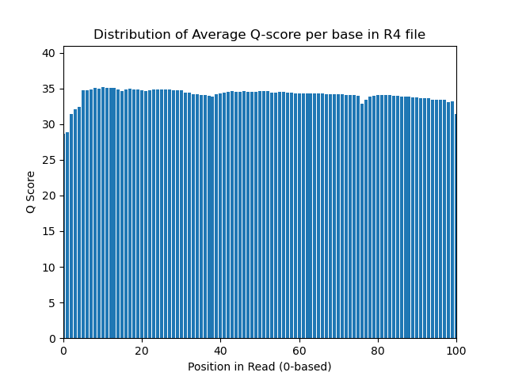
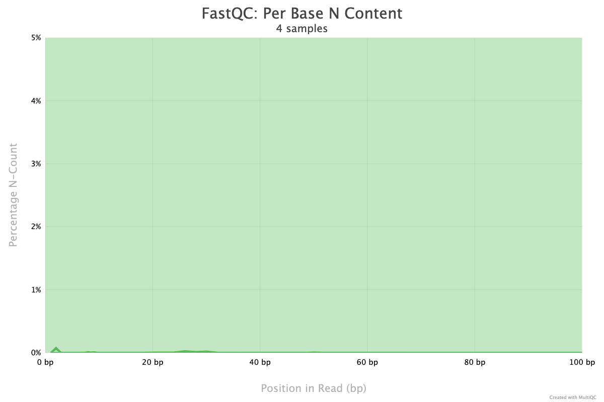

# Part 1 

## FastQC Results Interpretation
    The per-base N content plots appear to be consistent with the quality score plots. There 
    is a small uptick in N content at the beginning of sequences and that is reflected by 
    the initial lower quality of sequences. The plots are included below.

### 29_4E_fox R1 
{width=310px} {width=310px}

### 29_4E_fox R2
{width=310px} {width=310px}

### Undetermined R1
{width=310px} {width=310px}

### Undetermined R2
{width=310px} {width=310px}

## FastQC Plots vs. Demux Plots
    The quality score plots appear to be very similar. Each pair shows nearly (if not) identical 
    scores per base position. There is a difference only in width of bins on my demux plots, which 
    initially made it appear as though my plots were different from FastQC's. 

    Run time and Mem/CPU usage was rather different, this is to be expected given FastQC is an 
    extremely well established and optimized tool for bioinfomatic analyses. Comparing my personal 
    code to that of such a tool is a bit unfair. I'm confident I could produce better run-times 
    and lower CPU+Memory usage from my code if I was given the opportunity to develop the code 
    from 2010 until now, as FastQC has been. 

    Demux plots included below.

### 29_4E_fox
{width=310px} {width=310px}

### Undetermined
{width=310px} {width=310px}

## Data Quality Analysis 

    Assessing the entire FastQC report generated for each sample, the 29_4E_fox library appears 
    to be adequate for subsequent analysis. In all four reports, there were 0 reads identified as 
    low quality. The Undetermined library may not be a great choice for further analysis due to 
    high levels of sequence duplication, 20% or so higher than the duplication levels observed in 
    the 29_4E_fox library. Duplication is something that can be dealt with computationally, 
    but generally losing more than half of the library when doing so, isn't a great sign.

# Part 2

## Trimmed Read %

        11.62% reads were trimmed from the Undetermined Library

        5.29% reads were trimmed from the 29_4E_fox library

### Undetermined Library Trimming Statistics
        Input Read Pairs:       14760166 
        Both Surviving:         12160071 (82.38%) 
        Forward Only Surviving: 2511252 (17.01%) 
        Reverse Only Surviving: 31174 (0.21%) 
        Dropped:                57669 (0.39%)

### 29_4E_fox Library Trimming Statistics
        Input Read Pairs:       4827433 
        Both Surviving:         4571904 (94.71%) 
        Forward Only Surviving: 247896 (5.14%) 
        Reverse Only Surviving: 3367 (0.07%) 
        Dropped:                4266 (0.09%)

## Sanity Check

    Adapter sequences were confirmed by investigating the metadata and thusly the library prep. 
    Although a Kapa kit is utilized, it is not specifically stated what adapter sequences were 
    utilized. The FastQC reports indicate that Illumina Universal Adapters were dectected so 
    I then looked for those and didn't find much. Spoke with Leslie and was directed to an 
    illumina page that had the adapter sequences provided. I think the original site I had 
    found was deprecated and moved to the link that Leslie provided. The adapters are present 
    and identified as TruSeq. 
```
        zcat <file> | grep '<adapter sequence>' | wc -l
```

    This command outputs the count of sequences that contain the adapter sequence. 

        Undetermined R1 adapter sequence count:   30,808
        Undetermined R2 adapter sequence count:   34,088
        29_4E_fox R1 adapter sequence count:      39,701
        29_4E_fox R2 adapter sequence count:      39,929
         
&nbsp;

```
        zcat <file> | awk -v s="<adapter sequence>" 'i=index($0, s) {print i}' |\
         awk '{position+=$0} END {print position/NR}'`
```
    This command outputs the average position of the adapter sequence in the input fastQ 
    file. Awk is first used to identify the position where the adapter appears in each 
    read. This is then piped to another awk that provides an average of the supplied 
    positions. The adapter sequence is 33 characters long, so there should be an average 
    position near/around 68, assuming adapters exist mostly on the 3' end of reads.

        Undetermined R1 average adapter position:   57.8274
        Undetermined R2 average adapter position:   57.2016
        29_4E_fox R1 average adapter position:      60.0634
        29_4E_fox R2 average adapter position:      60.0374

&nbsp;

    For both files in the either library, the adapters appear more on the 3' end of 
    the reads. This is a good sign. 


## Trimmed Read Length Plots

    R1 & R2 files should be trimmed at similar rates, I do expect to see more trimming 
    on Undetermined R2 as its adapter is present more often than R1's adapter is in R1. 
    This could be due to random chance, and the adapter sequence appearing naturally in 
    other places in the reads, but the average location of the adapter is nearly identical 
    to the average observed for the R1 adapter. 

{width=450px}

{width=450px}

## Trimmed FastQC

    Went ahead and ran multiQC on raw and trimmed fastQC files for easier summary of 
    statistics. The trimmed datasets have an modestly increased sequence quality, 
    likely due to the reduced N content (both sets of plots included below). The 
    trimmed dataset also has a drastically decreased number of adapter sequences, 
    which is to be expected after trimming. Due to the adapters being trimmed, there 
    is also an uptick in quality at the ends of reads.
 
### Raw Vs. Trimmed Per Base Sequence Quality

{width=310px} {width=310px}

### Raw Vs. Trimmed Adapter Content

{width=310px} {width=310px}

### Raw Vs. Trimmed Per Base N Content

{width=310px} {width=310px}

# Part 3

## PS8 Script Outputs

### 29_4E_fox
        Mapped                  8,883,008
        Unmapped                260,800
### Undetermined    
        Mapped                  15,584,503
        Unmapped                8,735,639 

&nbsp;

## htseq-count Outputs

### 29_4E_fox
#### Stranded=yes 
        Mapped                  179,976
        No Feature	            4,057,913
        Ambiguous	            3,040
        Too Low Quality	        8,168
        Not Aligned	            126,013
        Alignment Not Unique	196,794

#### Stranded=reverse
        Mapped                  3,859,630
        No Feature	            302,549
        Ambiguous	            78,750
        Too Low Quality	        8,168
        Not Aligned	            126,013
        Alignment Not Unique	196,794

### Undetermined 
#### Stranded=yes 
        Mapped                  292,237  
        No Feature	            7,078,461
        Ambiguous	            5,990
        Too Low Quality	        79,473
        Not Aligned	            4,325,477
        Alignment Not Unique	378,433

#### Stranded=reverse
        Mapped                  6,616,501
        No Feature	            629,222
        Ambiguous	            130,965
        Too Low Quality	        79,473
        Not Aligned	            4,325,477
        Alignment Not Unique	378,433

## Library Discussion

These reads are from "strand-specific" RNA-Seq Libraries, because we can observe a difference
in mapping counts depending on how htseq-count's stranded flag is set. When the flag is set
to "stranded=yes", the software checks that reads are in the same oreintation as the supplied
transcripts. If this were the case for our datasets, we should observe higher feature mapping
counts when the stranded flag is set to "yes". Instead, we see drastically higher feature mapping 
counts when the flag is set to "reverse". This is supported by the fact that Illumina's TruSeq
protocol produces libraries that are in reverse oreintation to feature transcripts. 

    